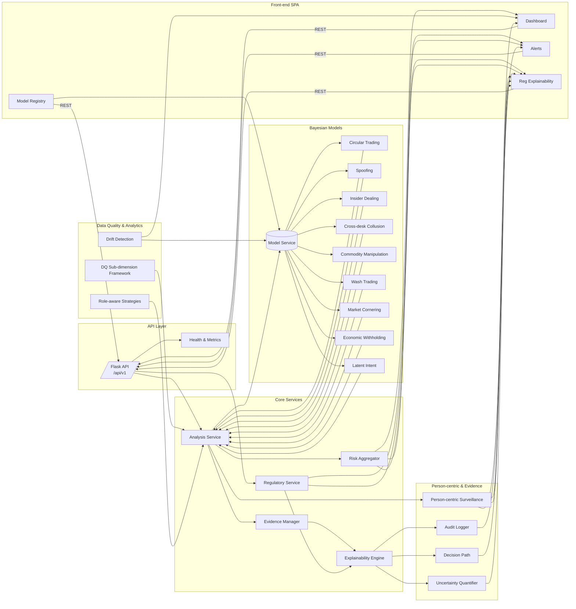

# Kor.ai Surveillance Platform — Architecture Overview

This briefing captures how the Kor.ai surveillance platform is put together across back-end, model, analytics, explainability, and front-end layers.

## 1. End-to-end system flow

1. **API ingress.** A Flask application exposes `/api/v1` endpoints for trade analysis, simulations, and model registry access while applying CORS policies and constructing responses with risk scores, alerts, and regulatory rationales.【F:src/app.py†L16-L177】
2. **Analysis orchestration.** The `AnalysisService` wires together the Bayesian engine, data processor, alerting, and overall risk calculator to process trades, compute typology scores, and package alerts and metadata for downstream use, including batch processing paths.【F:src/core/services/analysis_service.py†L1-L180】
3. **Regulatory rationale.** The `RegulatoryService` adds deterministic narratives, inference paths, and compliance notes around alerts by invoking the regulatory explainability engine, ensuring outputs align with MAR, STOR, MiFID II, and related frameworks.【F:src/core/services/regulatory_service.py†L1-L143】
4. **Explainability & audit trail.** Model-level explainability covers feature attribution, counterfactuals, decision paths, uncertainty analysis, audit logging, and governance tracking to satisfy transparency requirements and traceability mandates.【F:src/models/explainability/explainability_engine.py†L1-L175】【F:src/models/explainability/audit_logger.py†L1-L159】
5. **Person-centric view.** A dedicated surveillance engine resolves identities, aggregates evidence, executes cross-typology reasoning, and generates person-level alerts with performance metrics for end-user consumption or escalation workflows.【F:src/core/person_centric_surveillance_engine.py†L1-L193】
6. **Front-end delivery.** A React SPA with dashboards, alert summaries, case navigation, and model registry views consumes the `/api/v1` services via a shared HTTP client, adapting to configured origins for deployment flexibility.【F:src/App.jsx†L1-L33】【F:src/pages/Dashboard.jsx†L1-L71】【F:src/pages/Alerts.jsx†L1-L64】【F:src/pages/Models.jsx†L1-L165】【F:src/services/httpClient.js†L1-L100】【F:src/utils/apiOrigin.js†L1-L23】

## 2. Architectural landscape by directory

| Layer | Key directories & responsibilities |
| --- | --- |
| **Application/API** | Flask entrypoint (`src/app.py`) and versioned blueprints under `src/api/v1` covering analysis, alerts, health, and data-quality endpoints with validation and error middleware.【F:src/app.py†L16-L200】【F:src/api/v1/routes/analysis.py†L1-L105】 |
| **Core engines & services** | Bayesian inference engine, risk calculators, aggregators, evidence mappers, reporting, security helpers, and node libraries inside `src/core`, including complex risk aggregation and regulatory explainability pipelines.【F:src/core/risk_aggregator.py†L1-L120】【F:src/core/regulatory_explainability.py†L1-L125】 |
| **Models** | Bayesian models, shared node templates, evidence sufficiency tools, person-centric domain objects, and model service abstractions in `src/models` supporting risk scoring and registry metadata.【F:src/models/bayesian/registry.py†L1-L80】【F:src/models/bayesian/shared/node_library.py†L1-L158】【F:src/models/services.py†L1-L200】 |
| **Explainability** | Feature attribution, counterfactual generation, decision path visualization, uncertainty quantification, audit logging, and governance tooling to meet regulatory explainability demands.【F:src/models/explainability/explainability_engine.py†L1-L175】【F:src/models/explainability/audit_logger.py†L1-L159】 |
| **Analytics** | Model drift detection and integration with OpenInference tracing for continuous monitoring and forecasting under `src/analytics`.【F:src/analytics/drift_detection.py†L1-L90】 |
| **Services (front-end utilities)** | Browser-side alert service stubs and HTTP helpers under `src/services`, plus server-side data-quality services that load strategies, sufficiency indices, and role-aware rules.【F:src/services/alerts.js†L1-L7】【F:src/services/data_quality/dq_subdimension_framework.py†L1-L153】 |
| **Processors & evidence** | Data processor adapters and evidence mappers in `src/core/processors`, alongside enumerated evidence types and cross-reference builders in `src/core/evidence` used by explainability and reporting flows.【F:src/core/processors/data_processor.py†L1-L160】【F:src/core/evidence/evidence_types.py†L1-L136】 |
| **Utilities & configuration** | Environment-aware configuration loader, logging setup, API origin utilities, and OpenInference tracing helpers under `src/utils`, with environment-specific JSON/YAML configuration in `config/` documented for deployment teams.【F:src/utils/config.py†L1-L160】【F:config/README.md†L1-L66】 |
| **Documentation** | Structured documentation tree in `docs/` covering architecture, models, deployment, and development guides to keep stakeholders aligned.【F:docs/README.md†L1-L42】 |

## 3. Bayesian model portfolio

The Bayesian registry enumerates the surveillance typologies (plus latent intent support) that power the risk engine and front-end model catalogue. All models share node templates, fallback logic, and evidence sufficiency tooling from the `shared` package.【F:src/models/bayesian/registry.py†L1-L80】【F:src/models/bayesian/shared/node_library.py†L1-L158】

| Model ID | Focus area | Notes |
| --- | --- | --- |
| `insider_dealing` | Detects misuse of material non-public information via trader role, PnL, communications, and timing cues. | Supports latent intent configuration and feeds overall risk aggregation.【F:src/models/bayesian/registry.py†L21-L65】 |
| `spoofing` | Flags order book manipulation scenarios in equities/derivatives markets. | Shared explainability and alert generation pathways.【F:src/models/bayesian/registry.py†L21-L65】 |
| `latent_intent` | Captures hidden causality signals to augment other typologies. | Provides priors and latent nodes for other networks.【F:src/models/bayesian/registry.py†L21-L65】 |
| `commodity_manipulation` | Surfaces abusive behavior in commodity trading, factoring cross-market evidence. | Shares reusable node templates and CPDs.【F:src/models/bayesian/registry.py†L21-L65】【F:src/models/bayesian/shared/node_library.py†L1-L158】 |
| `circular_trading` | Identifies round-trip trades using coordination and settlement patterns, integrating regulatory narratives. | Builds on evidence sufficiency and explainability engines.【F:src/models/bayesian/circular_trading/model.py†L1-L120】 |
| `market_cornering` | Assesses attempts to control supply and pricing across markets. | Uses shared fallback priors and structured CPDs.【F:src/models/bayesian/registry.py†L21-L65】 |
| `cross_desk_collusion` | Detects coordinated behavior across trading desks with person-centric cues. | Works with entity resolution and cross-typology engines.【F:src/models/bayesian/registry.py†L21-L65】【F:src/core/person_centric_surveillance_engine.py†L22-L180】 |
| `wash_trade_detection` | Finds self-crossing trades, leveraging timing and beneficial ownership evidence. | Provides audit-ready evidence summaries.【F:src/models/bayesian/registry.py†L21-L65】【F:src/core/regulatory_explainability.py†L1-L125】 |
| `economic_withholding` | Monitors withholding or squeezing scenarios, complementing market abuse coverage. | Integrated into registry metadata and explainability tooling.【F:src/models/bayesian/registry.py†L21-L65】【F:src/models/explainability/explainability_engine.py†L1-L175】 |

The shared `ModelService` wraps the registry for prediction, validation, and normalized registry snapshots consumed by the `/api/v1/models/registry` endpoint and UI.【F:src/models/services.py†L1-L200】【F:src/app.py†L167-L177】【F:src/pages/Models.jsx†L70-L160】

## 4. Regulatory explainability and evidence management

- **Regulatory engine.** Generates audit-ready reports with evidence trails, cross-account patterns, STOR assessments, and escalation rationale while mapping to MAR, MiFID II, ESMA, FCA, and related frameworks.【F:src/core/regulatory_explainability.py†L1-L122】
- **Evidence taxonomy.** Enumerations and cross-reference builders standardize how trading patterns, communications, timing anomalies, and other signals are tracked, with severity and regulatory context metadata ready for serialization.【F:src/core/evidence/evidence_types.py†L1-L136】
- **Decision auditing.** The audit logger records model decisions, compliance checks, and high-risk documentation to create durable audit trails that pair with generated rationales.【F:src/models/explainability/audit_logger.py†L30-L159】

## 5. Data quality and analytics controls

- **DQ Sub-dimensions.** A comprehensive framework drives measurement types, comparison rules, and fallback requirements so surveillance strategies can adapt to upstream data conditions.【F:src/services/data_quality/dq_subdimension_framework.py†L1-L153】
- **Role-aware strategies.** Services load fallback and role-aware sufficiency strategies that are invoked by processors and explainability engines when evidence gaps arise.【F:src/core/role_aware_dq_strategy.py†L1-L160】【F:src/core/evidence_sufficiency_index.py†L1-L140】
- **Drift monitoring.** The advanced drift analyzer applies KS tests, PSI, Jensen–Shannon divergence, root-cause analysis, and OpenInference tracing to monitor model health and forecast emerging drift risks.【F:src/analytics/drift_detection.py†L1-L90】

## 6. Front-end experience and services

- **Navigation shell.** React Router hosts dashboard, alert, case, and model registry routes with a persistent nav bar for quick access during investigations.【F:src/App.jsx†L1-L33】【F:src/components/TopNavBar.jsx†L1-L22】
- **Operational views.** The dashboard streams alert history from the API, the alerts page provides styled summaries (defaulting to mocks until live integration), and the models page renders the authoritative registry snapshot with loading, error, and empty states.【F:src/pages/Dashboard.jsx†L5-L68】【F:src/pages/Alerts.jsx†L28-L62】【F:src/pages/Models.jsx†L70-L160】
- **Client utilities.** A hardened HTTP client and origin helper centralize fetch logic, content-type handling, and environment configuration so that front-end requests align with deployment settings.【F:src/services/httpClient.js†L1-L100】【F:src/utils/apiOrigin.js†L1-L23】

## 7. Documentation and configuration readiness

Stakeholders can dive deeper through the curated documentation tree and configuration references that outline environment overrides, risk thresholds, and deployment practices—useful when preparing collateral or onboarding teams.【F:docs/README.md†L1-L42】【F:config/README.md†L1-L66】

## 8. Strawman system diagram

---
This overview ties each subsystem back to its source to show a consolidated map of how Kor.ai’s surveillance stack fits together across models, services, explainability, data quality, analytics, and the investigative UI.
