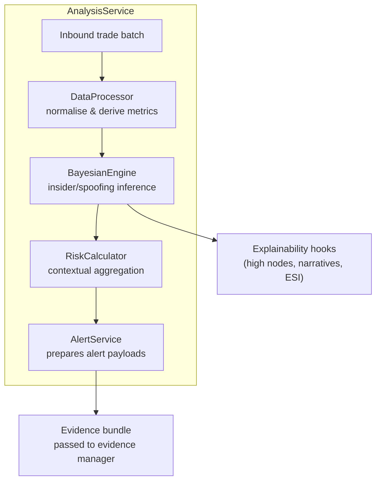
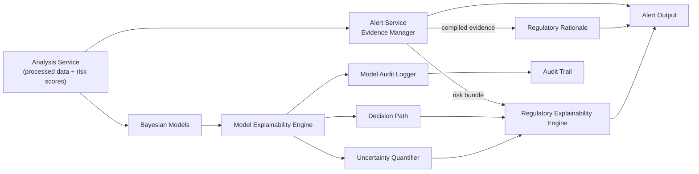

# Evidence Pipeline and Explainability Deep Dive

This guide zooms into how the platform turns processed trade data into fully explained, audit-ready alerts. It follows the flow from the analysis service into evidence management, explainability engines, uncertainty assessment, and audit logging before alerts are emitted.

## 1. Inputs sourced from the analysis service

The `AnalysisService` prepares the payload that downstream evidence tooling expects. It enriches raw trade batches, calculates typology risk, and returns a structured result containing processed metrics, risk scores, and generated alerts.【F:src/core/services/analysis_service.py†L22-L129】 This hand-off gives evidence components:

- `processed_data`: normalized trades, metrics (volume, price impact, timing), timeframe, instruments, and trader metadata.
- `risk_scores`: insider, spoofing, and aggregate risk objects derived from Bayesian engines plus sufficiency calculations.
- `alerts`: pre-filtered alert shells that already embed severity, typology, high/critical nodes, and evidence sufficiency snapshots ready for decoration.【F:src/core/services/alert_service.py†L16-L199】

### 1.1 Analysis service orchestration

Internally the service composes four engines so downstream evidence tooling can assume consistent structure:

- **Data processing.** `DataProcessor` normalizes trades and orders, derives metrics (volume imbalance, price impact, timing, cancellation ratios), and annotates timeframe, instruments, and insider indicators that the rest of the stack reuses.【F:src/core/processors/data_processor.py†L1-L120】
- **Bayesian scoring.** `BayesianEngine` loads insider and spoofing networks, applies latent-intent variants when requested, and augments outputs with evidence sufficiency and explainability hooks consumed by the evidence manager.【F:src/core/services/analysis_service.py†L46-L107】【F:src/core/engines/bayesian_engine.py†L18-L80】
- **Risk aggregation.** `RiskCalculator` blends typology scores with contextual multipliers (role, volume, timeframe, behaviour) so evidence payloads already include holistic risk.【F:src/core/engines/risk_calculator.py†L9-L95】
- **Alert priming.** `AlertService` packages typology findings, high/critical nodes, explanations, and sufficiency indexes into ready-to-publish alert shells that can be enriched further by regulatory explainability.【F:src/core/services/analysis_service.py†L94-L116】【F:src/core/services/alert_service.py†L16-L199】

## 2. Evidence manager responsibilities within alert generation

Alert generation doubles as an evidence manager that curates the payload attached to each alert:

- `AlertService.generate_alerts` evaluates news context, typology thresholds, and risk bands to decide whether evidence should escalate into an alert queue.【F:src/core/services/alert_service.py†L33-L147】
- When an alert fires, `_compile_*_evidence` extracts the processed metrics the analysis service supplied (insider indicators, pre-event trading, cancellation ratios, etc.) and nests model highlights such as high/critical nodes or explanations so downstream views see the exact evidence basis.【F:src/core/services/alert_service.py†L342-L375】
- These evidence bundles keep the risk scoring artefacts close to the generated alert, acting as the manager that maintains provenance before explainability engines add richer narratives.

## 3. Regulatory evidence engine

The regulatory explainability layer consumes the alert + risk bundle to build regulatory-grade artefacts:

- The light-weight `RegulatoryExplainability.generate_regulatory_rationale` version used in API flows repackages the alert, risk scores, and processed metrics into deterministic narratives, inference paths, and audit summaries so every alert ships with a reproducible explanation.【F:src/core/regulatory_explainability.py†L1036-L1119】
- The advanced `RegulatoryExplainabilityEngine` (used by person-centric and regulatory services) organizes evidence by account, derives cross-account patterns, creates evidence chains/decision trees, maps frameworks (MAR, STOR, MiFID II), and assembles escalation rationale from the same inputs.【F:src/core/regulatory_explainability.py†L240-L389】
- Both layers expect the analysis service to pass through raw metrics and typology context so regulatory narratives can trace each claim back to specific evidence items.

## 4. Model explainability: decision paths and uncertainty

Model-level explainability runs alongside evidence management to expose decision logic:

- Enhanced Bayesian models instantiate `ModelExplainabilityEngine` instances that orchestrate feature attribution, counterfactuals, decision path visualization, and uncertainty analysis per model result.【F:src/models/bayesian/insider_dealing/enhanced_model.py†L57-L125】【F:src/models/explainability/explainability_engine.py†L66-L170】
- The decision-path component captures node-by-node reasoning so regulatory reports can cite the exact evidence route, while the uncertainty quantifier summarises epistemic/aleatoric uncertainty and overall reliability for the prediction.【F:src/models/explainability/explainability_engine.py†L133-L151】【F:src/models/explainability/explainability_engine.py†L138-L151】【F:src/models/explainability/decision_path_visualizer.py†L12-L23】【F:src/models/explainability/uncertainty_quantifier.py†L12-L29】
- Generated explanations are attached to the enhanced risk result and reused by both evidence managers and the audit logger, ensuring downstream artefacts align with the exact model view of evidence.【F:src/models/bayesian/insider_dealing/enhanced_model.py†L96-L125】

## 5. Audit logging handshake

Whenever explainable models calculate risk, the enhanced flow records the decision via the `ModelAuditLogger`. Each audit entry captures the decision payload, explanations, compliance checks, and optional documentation generation for high-risk cases, creating a tamper-resistant trail that aligns with evidence bundles served to analysts and regulators.【F:src/models/bayesian/insider_dealing/enhanced_model.py†L127-L156】【F:src/models/explainability/audit_logger.py†L30-L158】

## 6. What the evidence stack needs from the analysis service

To keep evidence, explainability, and audit components in sync, the analysis service must continue supplying:

- Rich `processed_data.metrics` so regulatory inference paths and decision trees can reference quantitative features without recomputation.【F:src/core/regulatory_explainability.py†L1078-L1101】
- Trader/account metadata (`trader_info`, linked accounts, timeframe) for cross-account pattern detection and escalation narratives.【F:src/core/services/alert_service.py†L178-L195】【F:src/core/regulatory_explainability.py†L321-L389】
- Model highlights (`high_nodes`, `critical_nodes`, `esi`, `explanation`) produced by Bayesian scoring to seed decision paths, uncertainty summaries, and audit context.【F:src/core/services/alert_service.py†L186-L195】【F:src/models/bayesian/insider_dealing/enhanced_model.py†L96-L134】

## 7. Evidence-to-alert flow diagram

The diagram highlights how the analysis service primes both the alert service (evidence manager) and the Bayesian explainability stack. Decision paths, uncertainty metrics, and audit logs converge back into regulatory outputs so every alert is accompanied by traceable evidence and documentation ready for print or escalation.
