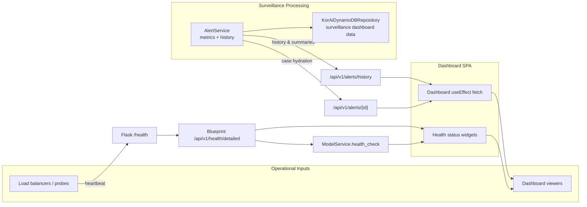

# Health & Metrics Telemetry Flow

This guide explains how the platform captures operational health, aggregates surveillance metrics, and streams them from the Flask API through to the investigative dashboard. It maps the concrete endpoints, services, and persistence layers that participate in the loop so the health surface can be printed or shared with stakeholders.

## 1. Health surfaces exposed by the API layer

- **Application heartbeat.** The Flask entrypoint exposes `/health` as a lightweight heartbeat that returns the service name, deployment environment, build version, and timestamp so load balancers and uptime monitors can verify availability with minimal overhead.【F:src/app.py†L16-L58】
- **Versioned health blueprint.** The `api/v1` blueprint expands the surface with `/health` and `/health/detailed`, formatting responses through `HealthResponseSchema` so all callers receive timestamped payloads with consistent fields whether they hit the root app or the versioned namespace.【F:src/api/v1/routes/health.py†L12-L61】【F:src/api/v1/schemas/response_schemas.py†L324-L345】
- **Service level diagnostics.** Model orchestration can self-assess by calling `ModelService.health_check`, which validates registry access, attempts to instantiate a model, and returns structured metadata that downstream monitors can record alongside API status checks.【F:src/models/services.py†L326-L367】

These layers let the dashboard choose between a fast readiness probe, a richer component breakdown, or a deep model registry diagnostic depending on the operational question being asked.

## 2. Metrics captured during surveillance processing

- **In-memory alert history.** As the alert engine runs, every generated alert is appended to `AlertService.alert_history`, which then powers filtered history queries, summary counts, and trend calculations without re-scoring historical batches.【F:src/core/services/alert_service.py†L26-L138】【F:src/core/services/alert_service.py†L474-L533】
- **Roll-up summaries.** The same service exposes helpers such as `get_alert_summary` that bucket alerts by severity over configurable windows so operations teams can trend spikes even before exporting to external storage.【F:src/core/services/alert_service.py†L534-L561】
- **Persistent dashboard metrics.** When DynamoDB is enabled, `KorAiDynamoDBRepository.get_surveillance_dashboard_data` fans out across global secondary indexes to gather the latest high/critical alerts, pending compliance reviews, and daily risk scores, returning a consolidated summary block for presentation layers.【F:src/services/kor_ai_dynamodb_implementation.py†L674-L713】
- **Node usage telemetry.** The `ComplexRiskAggregator` tallies every high or critical Bayesian node involved in a case, and those counts are preserved on the alerts produced by `AlertService` and ultimately stored alongside DynamoDB metadata so the dashboard can highlight which typologies are firing most often.【F:src/core/risk_aggregator.py†L135-L226】【F:src/core/services/alert_service.py†L178-L240】【F:src/services/kor_ai_dynamodb_implementation.py†L247-L288】
- **OpenInference tracing spans.** The enhanced Bayesian engine wraps each inference run in `KorinsicOpenInferenceTracer` spans, recording processing times, confidence measures, and contextual attributes so observability backends fed by the health pipeline can correlate API status with model behaviour.【F:src/core/engines/enhanced_bayesian_engine.py†L44-L216】【F:src/utils/openinference_tracer.py†L30-L160】

Together these paths ensure both transient and durable metrics stay aligned with the evidence that produced them.

## 3. API responses that deliver metrics to clients

- **Alerts history endpoint.** `/api/v1/alerts/history` wraps the alert history helpers, applying optional filters before serialising results with `AlertsResponseSchema` so the dashboard receives normalized IDs, types, severity, and timestamps for rendering and drill-down navigation.【F:src/api/v1/routes/alerts.py†L15-L66】
- **Detailed alert retrieval.** `/api/v1/alerts/<alert_id>` allows the dashboard to hydrate a case view with the same evidence payload the alert engine produced, ensuring health panels can pivot from counts into root-cause narratives when analysts investigate anomalies.【F:src/api/v1/routes/alerts.py†L68-L97】
- **Health payload delivery.** The `/api/v1/health/detailed` route merges component statuses with uptime placeholders so front-ends or monitoring widgets can display a traffic-light view without requiring privileged infrastructure access.【F:src/api/v1/routes/health.py†L32-L61】

## 4. Dashboard consumption pattern

The React SPA bootstraps its API origin at runtime and, on load, queries the alerts history endpoint to render the operational panel. Errors bubble into inline notifications so availability issues detected via the health endpoints manifest quickly for analysts.【F:src/utils/apiOrigin.js†L1-L23】【F:src/pages/Dashboard.jsx†L1-L69】

When paired with the health endpoints above, this creates a feedback loop where the UI can show both the current service posture and the surveillance throughput it is receiving.

## 5. Health & metrics flow diagram

The diagram shows how probes hit the lightweight Flask heartbeat, richer diagnostics flow through the versioned API, and the same alert metrics surface through both in-memory histories and DynamoDB-backed summaries before the dashboard renders them for analysts.
