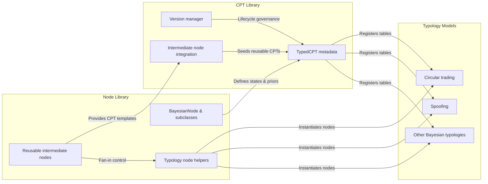

# Node Library and CPT Library Deep Dive

This guide zooms into how the Kor.ai surveillance platform constructs Bayesian networks across typologies by standardising node definitions, cross-model reuse, and conditional probability governance.

## 1. Node primitives and hierarchy

The core node library defines the fundamental classes that every Bayesian network instance uses:

- **`BayesianNode`** holds shared attributes such as name, state space, CPT payload, description, and fallback priors, and exposes helpers for CPT management and documentation exports.【F:src/core/node_library.py†L11-L40】
- **Specialised subclasses** – `EvidenceNode`, `RiskFactorNode`, and `OutcomeNode` – capture the three canonical layers (observed evidence, aggregated latent risk, and typology outcome) while inheriting the shared metadata contract.【F:src/core/node_library.py†L43-L105】
- **Latent intent and evidence families** extend these bases to capture converging behavioural paths (profit motivation, access patterns, order behaviour, communications metadata, market structure cues, etc.) with curated state vocabularies and priors.【F:src/core/node_library.py†L136-L415】

These primitives underpin both the central `BayesianNodeLibrary` and typology-specific helpers.

## 2. Central node library services

`BayesianNodeLibrary` packages the node classes and templates so model builders can materialise consistent node objects on demand.【F:src/models/bayesian/shared/node_library.py†L1087-L1322】 Key capabilities include:

- **Type registry.** A single mapping from semantic node types (e.g., `order_clustering`, `collusion_latent_intent`) to their concrete classes, letting typology code request nodes by business concept instead of class name.【F:src/models/bayesian/shared/node_library.py†L1097-L1145】
- **Template catalogue.** Named templates for each typology define default states and descriptions, enabling one-line construction of standard evidence and outcome nodes when bespoke tuning is unnecessary.【F:src/models/bayesian/shared/node_library.py†L1147-L1202】
- **Specialisation guardrails.** Specialised nodes ignore external state overrides, ensuring that curated state vocabularies (e.g., `no_intent` → `clear_intent`) remain consistent across models.【F:src/models/bayesian/shared/node_library.py†L1221-L1276】

Typology modules (such as circular trading) request nodes through this library, which keeps evidence naming, priors, and descriptions synchronised for explainability outputs.【F:src/models/bayesian/circular_trading/nodes.py†L21-L188】

## 3. Multi-level Bayesian topology

Most typologies follow a three-to-five layer pattern:

1. **Evidence nodes** ingest domain signals (counterparty links, benchmark timing, news alignment, etc.).【F:src/models/bayesian/circular_trading/model.py†L88-L114】【F:src/models/bayesian/shared/node_library.py†L1111-L1163】
2. **Intermediate risk aggregators** optionally reduce parent fan-in using reusable intermediate nodes (see §4), or feed directly into latent intent nodes.【F:src/models/bayesian/shared/model_builder.py†L274-L292】【F:src/models/bayesian/shared/reusable_intermediate_nodes.py†L23-L193】
3. **Latent intent nodes** capture unobservable intent using weighted evidence contributions so the platform can reason about hidden causality.【F:src/core/node_library.py†L418-L605】【F:src/models/bayesian/shared/model_builder.py†L342-L365】
4. **Risk factor nodes** absorb latent intent plus traditional evidence to provide a calibrated risk level, capping parent combinations for tractable CPTs.【F:src/models/bayesian/shared/model_builder.py†L369-L385】
5. **Outcome nodes** expose final typology risk states for downstream services and reporting.【F:src/models/bayesian/shared/model_builder.py†L386-L411】

The circular trading model demonstrates both the standard and latent-intent-enhanced variants with identical evidence layers, optional latent intent, and a shared outcome definition to maintain consistent consumer contracts.【F:src/models/bayesian/circular_trading/model.py†L78-L170】

## 4. Reusable intermediate nodes and fan-in control

To prevent exponential CPT growth, the shared reusable intermediate node library offers pre-built aggregators with noisy-OR generation tailored to recurring patterns (market impact, behavioural intent, coordination, etc.).【F:src/models/bayesian/shared/reusable_intermediate_nodes.py†L1-L191】 Each class:

- Caps parent counts (≤4) and records the typologies it applies to, promoting cross-model reuse.【F:src/models/bayesian/shared/reusable_intermediate_nodes.py†L37-L59】【F:src/models/bayesian/shared/reusable_intermediate_nodes.py†L122-L144】
- Pulls leak and parent influence parameters from the probability configuration module to enforce global calibration.【F:src/models/bayesian/shared/reusable_intermediate_nodes.py†L68-L86】【F:src/models/bayesian/shared/probability_config.py†L266-L308】
- Emits validated `TabularCPD` instances with automatic normalisation, which the CPT library can register without bespoke coding per typology.【F:src/models/bayesian/shared/reusable_intermediate_nodes.py†L60-L106】

## 5. CPT library governance

All conditional probability tables, whether handcrafted or generated, flow through the shared CPT library for lifecycle management.【F:src/models/bayesian/shared/cpt_library/library.py†L1-L193】 Core features include:

- **Typed CPT definitions.** `TypedCPT` pairs probability tables with metadata describing node states, parent states, regulatory rationale, and fallback priors, while validating structural integrity on instantiation.【F:src/models/bayesian/shared/cpt_library/typed_cpt.py†L14-L170】
- **Metadata and compliance tracking.** `CPTMetadata` stores version, status, enforcement references, and usage audit fields, enabling explainability narratives to cite regulatory bases.【F:src/models/bayesian/shared/cpt_library/typed_cpt.py†L33-L95】
- **Version control.** `CPTVersionManager` records every change (added, updated, validated, approved) with timestamps and change notes to satisfy governance requirements.【F:src/models/bayesian/shared/cpt_library/version_manager.py†L1-L108】
- **Indexed retrieval.** The library indexes CPTs by typology, node name, and regulatory framework so builders can request reusable distributions (e.g., share `market_impact` CPTs across spoofing and circular trading).【F:src/models/bayesian/shared/cpt_library/library.py†L37-L173】

## 6. Intermediate node integration into the CPT library

`IntermediateNodeCPTLibraryIntegration` seeds the CPT library with templates, metadata, and validation paths for every reusable intermediate node, guaranteeing parity between fan-in reductions and standard CPT management.【F:src/models/bayesian/shared/cpt_library/intermediate_node_integration.py†L1-L200】 It enumerates each intermediate node’s parents, downstream targets, regulatory basis, and applicable typologies, then creates templates with probability tables and fallback priors that align with the node classes’ expectations.【F:src/models/bayesian/shared/cpt_library/intermediate_node_integration.py†L74-L183】

When invoked, the integration writes templates into the library’s typology manager and validates them alongside other CPTs, ensuring the same governance pipeline (draft → validated → approved) applies to intermediate aggregators.【F:src/models/bayesian/shared/cpt_library/intermediate_node_integration.py†L160-L183】

## 7. Model assembly and CPT application

Typology builders stitch nodes and CPTs together using the shared infrastructure:

- Node helpers (e.g., `CircularTradingNodes`) instantiate nodes from the central library with consistent priors and metadata.【F:src/models/bayesian/circular_trading/nodes.py†L21-L188】
- Model builders wire evidence → latent intent → risk factor → outcome edges and attach CPDs, either by referencing the CPT library or by constructing network-specific tables that can later be promoted into the library.【F:src/models/bayesian/shared/model_builder.py†L274-L411】
- During inference setup, models pull node definitions and fallback priors to seed CPDs when explicit tables are absent, relying on utility functions like `normalize_cpt` to maintain valid probability distributions.【F:src/core/node_library.py†L294-L302】【F:src/models/bayesian/circular_trading/model.py†L172-L200】

## 8. Cross-typology reuse

Because every node and CPT carries typology applicability metadata, cross-over between models is explicit:

- Intermediate nodes declare which typologies they serve, enabling the CPT library to present shared templates across spoofing, circular trading, commodity manipulation, and energy withholding scenarios.【F:src/models/bayesian/shared/reusable_intermediate_nodes.py†L55-L58】【F:src/models/bayesian/shared/reusable_intermediate_nodes.py†L139-L143】
- The CPT library indexes by node name and typology, so a CPT calibrated for `order_clustering` in spoofing can also power circular trading intent calculations without duplication.【F:src/models/bayesian/shared/cpt_library/library.py†L160-L173】
- Probability configurations centralise leak rates and parent weights, ensuring that when nodes cross typologies their behaviour remains consistent with regulatory narratives.【F:src/models/bayesian/shared/probability_config.py†L266-L308】

Together, the node library, reusable intermediate layer, and CPT governance system ensure that every surveillance typology shares a coherent vocabulary, probability discipline, and audit trail while still allowing typology-specific extensions.

## 9. Node library and CPT architecture overview

