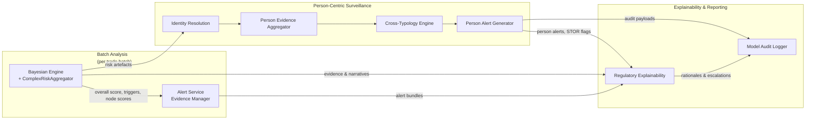

# Risk Aggregator and Person-Centric Surveillance Deep Dive

This guide focuses on how the complex risk aggregator and person-centric surveillance capabilities coordinate to turn evidence-rich Bayesian outputs into holistic, per-person alerts and regulatory narratives.

## 1. Position in the overall architecture

- **Complex risk aggregation** sits inside the Bayesian engine, blending calibrated node evidence with probabilistic risk to produce an overall score, risk level, and trigger metadata that downstream services consume alongside Bayesian outputs.【F:src/core/engines/bayesian_engine.py†L780-L843】【F:src/core/risk_aggregator.py†L122-L227】
- **Person-centric surveillance** orchestrates identity resolution, evidence aggregation, cross-typology reinforcement, and alert generation to convert account-based analytics into person-focused alerting, sharing the same evidentiary fabric as the core analysis flow.【F:src/core/person_centric_surveillance_engine.py†L38-L193】
- Together they provide the bridge from typology-specific scoring (per trade batch) to entity-level monitoring that compliance and regulatory teams expect.

## 2. ComplexRiskAggregator internals

`ComplexRiskAggregator` bootstraps a catalogue of node configurations that encode weights, high/critical thresholds, and human-readable descriptions for every contributor (e.g., MNPI access, PnL loss spikes, news context).【F:src/core/risk_aggregator.py†L43-L120】 Its scoring pipeline:

1. Normalises state indices onto a 0–1 scale and applies node weights, including a dedicated PnL loss multiplier when loss states appear.【F:src/core/risk_aggregator.py†L135-L167】
2. Tracks which evidence nodes breach high/critical thresholds so alerting can reason about trigger counts without recomputing features.【F:src/core/risk_aggregator.py†L170-L225】
3. Applies an exponential penalty when multiple high nodes co-occur, combines the weighted score with the Bayesian `overall_score`, and caps the final output at 1.0.【F:src/core/risk_aggregator.py†L176-L214】
4. Produces a structured explanation that lists score breakdowns, high/critical drivers, and top contributors—feeding straight into alert narratives and audit logging.【F:src/core/risk_aggregator.py†L244-L283】

## 3. Handshake with the Bayesian engine and analysis service

When the Bayesian engine finishes inference it maps processed trade metrics into aggregator-friendly evidence, adjusts for market news suppression, and invokes `compute_overall_risk_score` to derive the blended risk level and trigger flags.【F:src/core/engines/bayesian_engine.py†L789-L843】 The returned payload augments the Bayesian probabilities with:

- `overall_score` and `risk_level` that power triage thresholds and reporting.
- `triggers` detailing high-node counts, critical-node hits, and whether multi-node escalation fired—inputs the alert service uses to build escalation rationale.【F:src/core/risk_aggregator.py†L210-L227】【F:src/core/services/alert_service.py†L178-L195】
- Rich `node_scores` and `explanation` text that downstream explainability (regulatory rationale, audit logging, person-centric summarisation) can embed without reverse-engineering the model.【F:src/core/risk_aggregator.py†L210-L283】【F:src/models/explainability/audit_logger.py†L30-L158】

Because the aggregator is instantiated with the Bayesian engine, every trade analysis request delivers a unified view of probabilistic and evidence-weighted risk, giving the person-centric layer consistent inputs when it analyses cross-account histories.

## 4. Person-centric surveillance pipeline

`PersonCentricSurveillanceEngine.process_surveillance_data` implements a five-stage workflow that sits downstream of batch analysis but reuses the same processed metrics and risk artefacts.【F:src/core/person_centric_surveillance_engine.py†L116-L193】 The stages are:

1. **Identity resolution.** Resolve all accounts, communications, and HR entries to canonical persons, attaching person IDs and confidence scores to the data feeds.【F:src/core/person_centric_surveillance_engine.py†L194-L235】
2. **Evidence aggregation.** For each resolved person, aggregate trade, communication, timing, and access signals into a persistent `PersonRiskProfile` via the `PersonEvidenceAggregator`.【F:src/core/person_centric_surveillance_engine.py†L237-L260】【F:src/core/person_evidence_aggregator.py†L42-L129】
3. **Cross-typology analysis.** Share risk signals across typologies, compute correlation-informed boosts, and maintain active signal history using the cross-typology engine.【F:src/core/person_centric_surveillance_engine.py†L155-L159】【F:src/core/cross_typology_engine.py†L35-L164】
4. **Alert generation.** Run the alert generator per typology to calculate probabilistic risk, apply cross-typology adjustments, determine severity/confidence, and assemble regulatory-ready alert payloads.【F:src/core/person_centric_surveillance_engine.py†L161-L165】【F:src/core/person_centric_alert_generator.py†L85-L199】
5. **Performance telemetry.** Record throughput, alert counts, and active signal volumes so operations teams can monitor coverage.【F:src/core/person_centric_surveillance_engine.py†L167-L192】

## 5. Evidence aggregation and profile maintenance

The `PersonEvidenceAggregator` maintains rolling person profiles by weighting evidence types, correlating activity across accounts, and storing the resulting structures for reuse across batches.【F:src/core/person_evidence_aggregator.py†L42-L188】 Key behaviours:

- Weighting trading, communications, timing, and access patterns so profiles expose both signal strength and provenance.【F:src/core/person_evidence_aggregator.py†L47-L118】
- Calculating cross-account correlations and temporal clustering, enabling explainability narratives to cite coordinated behaviour across desks or time windows.【F:src/core/person_evidence_aggregator.py†L117-L188】
- Mapping evidence sources and updating timestamps, which the person-centric alert generator and regulatory explainability use to display provenance and freshness.【F:src/core/person_evidence_aggregator.py†L109-L129】【F:src/core/person_centric_alert_generator.py†L137-L190】

## 6. Cross-typology reinforcement and alert outputs

The cross-typology engine injects correlated signals between typologies, decaying them over time and adjusting per-typology priors when strong relationships exist (e.g., spoofing raising manipulation risk).【F:src/core/cross_typology_engine.py†L40-L211】 During alert creation the generator:

- Retrieves the cross-typology summary to compute probability adjustments and escalation factors.【F:src/core/person_centric_alert_generator.py†L120-L166】
- Builds regulatory rationales, escalation notes, and evidence trails so alerts align with explainability and audit expectations shared by the batch analysis pipeline.【F:src/core/person_centric_alert_generator.py†L152-L190】【F:src/models/explainability/explainability_engine.py†L66-L170】
- Flags STOR eligibility and person-level metrics (account coverage, key driver nodes) which the regulatory explainability engine later uses for escalation packages.【F:src/core/person_centric_alert_generator.py†L157-L190】【F:src/core/regulatory_explainability.py†L240-L389】

## 7. Risk aggregation to person-centric flow diagram

The diagram shows how the aggregator enriches Bayesian outputs before they feed both account-level alerting and the person-centric engine. Person-level alerts then loop back into regulatory explainability and audit logging, ensuring every escalation inherits consistent evidence, triggers, and narratives.
