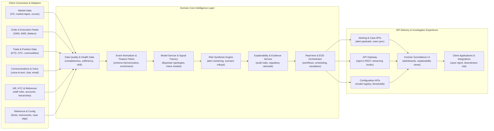

# Korinsic Platform — Tech Functional Diagram

This one-pager summarizes how client data flows into the Korinsic surveillance platform, how the core engines transform that data into risk intelligence, and how downstream teams consume the outputs. The layout reads left to right across three primary zones.

## Zone definitions

- **Client Connectors & Adaptors.** Upstream systems deliver market, order, trade, communications, and HR reference feeds through adaptable connectors so Korinsic ingests the same evidence clients already trust.
- **Korinsic Core Intelligence Layer.** Data is validated for quality, normalized into a common schema, scored by Bayesian typologies, synthesized into risk scenarios, and paired with explainable evidence before the orchestrator dispatches alerts in real time or scheduled end-of-day batches.
- **API Delivery & Investigator Experience.** REST and streaming APIs expose alerts, model configurations, and case synchronizations to Korinsic's UI and to the client's existing operational tooling.
